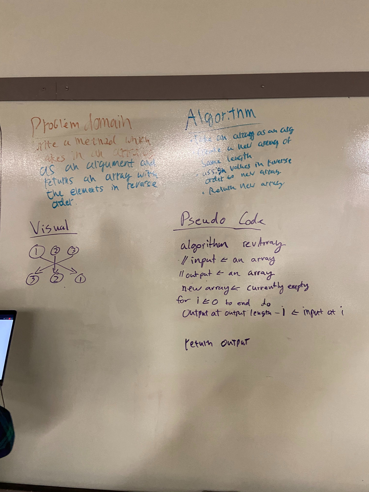

## Challenge
A method which takes in an array of integers and returns a new array with the elements reversed.

## Approach & Efficiency
We used a for loop to iterate through the input array and set the values of a new array to the input array in reverse order.

## Solution
