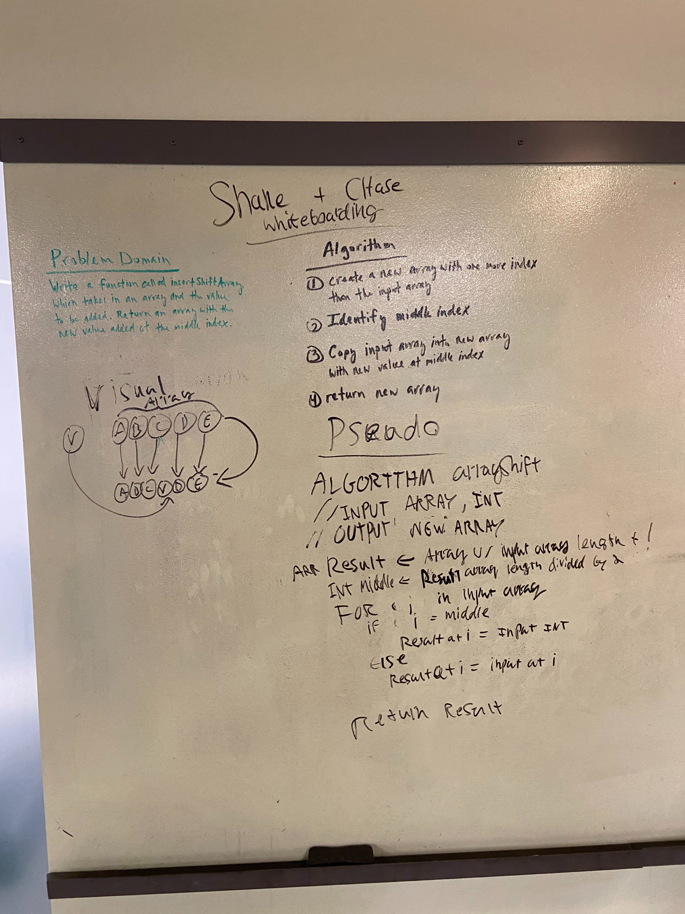

## Challenge
Create a method that takes an array and an element and inserts that element halfway through the array.

## Approach & Efficiency
Created a new array with a length of +1 the input array. Iterated through the input array and assign the values to the new array with the input element in the middle index.

## Solution
