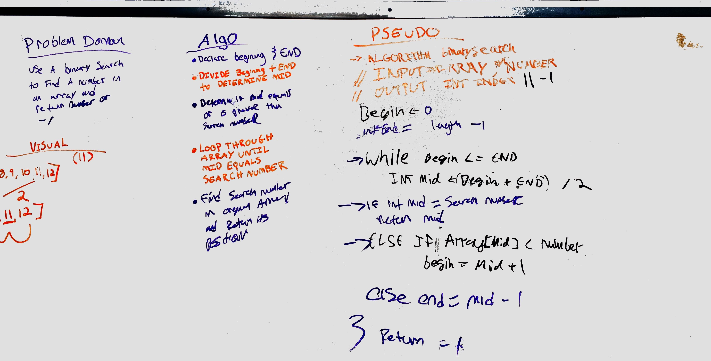

## Challenge
Create a binary search method to find the index of an array or return -1.

## Approach & Efficiency
Found the beginning and end of the input array. Find the middle. Check if the middle is equal to the input number. if it is not, set the beginning or end to middle +1 or middle -1, respectively.

## Solution
