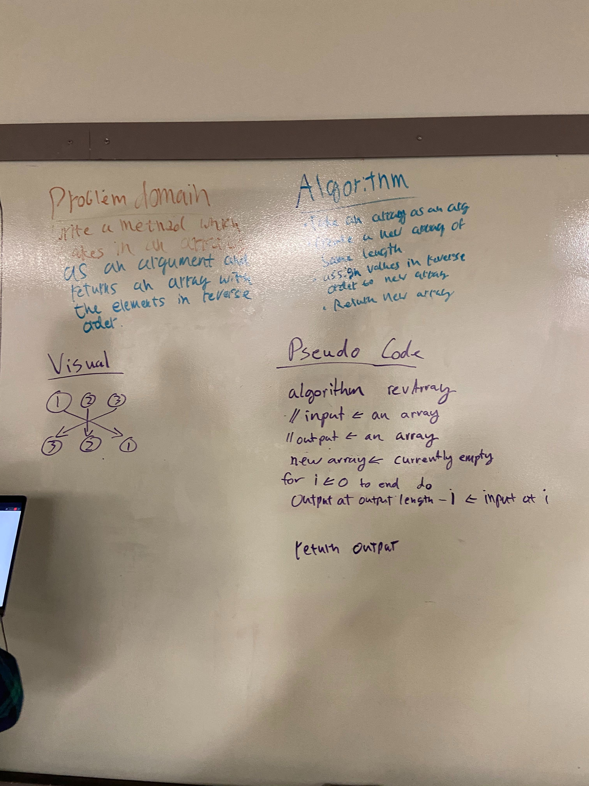

TABLE OF CONTENTS:
1. Array Reverse Challenge

## Challenge
A method which takes in an array of integers and returns a new array with the elements reversed.

## Approach & Efficiency
We used a for loop to iterate through the input array and set the values of a new array to the input array in reverse order.

## Solution

2. ArrayShift

## Challenge
Create a method that takes an array and an element and inserts that element halfway through the array.

## Approach & Efficiency
Created a new array with a length of +1 the input array. Iterated through the input array and assign the values to the new array with the input element in the middle index.

## Solution

